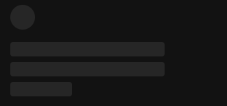

# React Skeleton EN

Ready Skeleton for your React project.
Incoming props for elements:

1. `<Skeleton.Avatar />`:
   - `size={`"xxl", "xl", "md", "sm" - select one`}`
2. `<Skeleton.Text />`:
   - `size={`: "title", "body", "footer" - select one`}`

- `br={`boolean`}`
- `anim={`boolean`}`

# RU

Готовый Скелетон для вашего Реакт проекта
Входящие пропсы для элементов:

1. `<Skeleton.Avatar />`:
   - `size={`"xxl", "xl", "md", "sm" - выбрать одно`}`
2. `<Skeleton.Text />`:
   - `size={`: "title", "body", "footer" - выбрать одно`}`

- `br={`boolean`}`
- `anim={`boolean`}`

## Preview

```jsx
  <Skeleton.Avatar size={"md"} br={true} />
  <Skeleton.Text size={"title"} br={true} />
  <Skeleton.Text size={"body"} br={true} />
  <Skeleton.Text size={"footer"} br={true} />
```



- Animation skeleton

```jsx
    <Skeleton.Avatar anim={true} size={"md"} br={true} />
    <Skeleton.Text anim={true} size={"title"} br={true} />
    <Skeleton.Text anim={true} size={"body"} br={true} />
    <Skeleton.Text anim={true} size={"footer"} br={true} />
```
